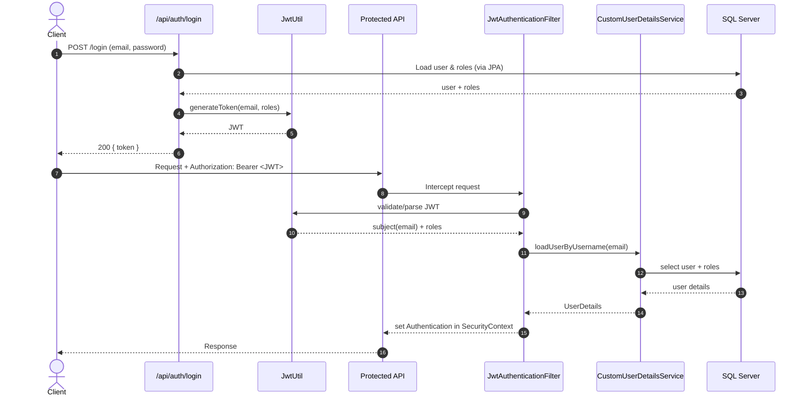

# Demo Assets (Architecture + JWT Flow + Demo Script)

Ngày: 2026-03-24

## 1) Slide outline: Kiến trúc hệ thống (gợi ý nội dung slide)

> File này là **outline** để bạn copy qua PowerPoint/Google Slides.

### Slide 1 — Title
- **ThucTapProject**
- Spring Boot REST API + JWT + JPA + Swagger
- Demo: Users / Projects / Tasks + phân quyền

### Slide 2 — Tech Stack
- Spring Boot 4.x
- Spring Security
- JWT (io.jsonwebtoken)
- Spring Data JPA (Hibernate)
- SQL Server
- Swagger/OpenAPI (springdoc)
- Build: Maven + runnable JAR

### Slide 3 — High-level Architecture
- Client (Swagger UI / Postman / Frontend)
- API Layer (Controllers)
- Service Layer (Business rules)
- Persistence Layer (Repositories + JPA Entities)
- Security Layer (JWT filter + UserDetails)
- Database: SQL Server

### Slide 4 — Request lifecycle (từ HTTP đến DB)
1. HTTP request -> Spring MVC Controller
2. (Nếu protected) đi qua `JwtAuthenticationFilter`
3. Controller gọi Service
4. Service gọi Repository
5. Repository (JPA/Hibernate) query DB
6. Response DTO -> JSON

### Slide 5 — Modules trong codebase
- `controller/` — REST endpoints
- `service/` — business logic
- `repository/` — JPA repositories
- `entity/` — JPA entities
- `security/` — JWT + Spring Security config
- `exception/` — ApiException + Global handler
- `model/request` + `model/response`

### Slide 6 — Authorization model (roles)
- USER
  - đăng nhập, xem task của chính mình
  - `/api/tasks/my`, `/api/tasks/detail/{id}` (bị giới hạn)
- MANAGER
  - quản lý user/project/task
  - create/update/delete/assign/change-status

### Slide 7 — Demo plan (những màn chính)
- Login -> lấy token
- Swagger Authorize -> gọi API protected
- Tạo project (MANAGER)
- Tạo task + assign task
- Login USER -> chỉ xem task của mình
- Test 403 khi USER gọi API MANAGER

---

## 2) Diagram: Sơ đồ flow JWT (Mermaid)

Bạn có thể dán đoạn Mermaid này vào các tool hỗ trợ Mermaid (GitHub, Mermaid Live Editor) hoặc chuyển sang hình ảnh.

## 3) Demo script checklist (Live demo qua Swagger)

> Mục tiêu: demo **tạo user/project/task** + **phân quyền** rõ ràng, ít rủi ro.

### A. Pre-demo checklist (trước khi bấm start)
- [ ] DB SQL Server đang chạy + schema đã import (`schema.sql` nếu cần)
- [ ] App chạy: `http://localhost:8080` (hoặc port ổn định)
- [ ] Swagger UI mở được: `/swagger-ui/index.html`
- [ ] Nút **Authorize** hiện, có scheme `bearerAuth`
- [ ] Có sẵn 2 account:
  - [ ] 1 MANAGER (để tạo project/task)
  - [ ] 1 USER (để demo bị giới hạn)

### B. Demo 1 — Login MANAGER + Authorize
- [ ] `POST /api/auth/login` (MANAGER)
- [ ] Copy token
- [ ] Authorize -> nhập `Bearer <token>`
- [ ] Gọi `GET /api/projects/list` để xác nhận token OK

### C. Demo 2 — Tạo project (MANAGER)
- [ ] `POST /api/projects/add`
- [ ] Chụp/hiển thị response thành công
- [ ] `GET /api/projects/list` -> thấy project mới

### D. Demo 3 — Tạo task + assign (MANAGER)
- [ ] `POST /api/tasks/add` (projectId + assignee)
- [ ] `GET /api/tasks/list-by-project/{id}` -> thấy task
- [ ] (Tuỳ) `PUT /api/tasks/assign/{taskId}/{userId}`
- [ ] `PUT /api/tasks/change-status/{taskId}/{status}`

### E. Demo 4 — Phân quyền (USER)
- [ ] Login USER -> lấy token mới
- [ ] Authorize bằng token USER
- [ ] `GET /api/tasks/my` -> thấy task của mình
- [ ] Thử gọi API manager-only (vd `POST /api/projects/add` hoặc `GET /api/users/list`) -> kỳ vọng `403`

### F. Wrap-up
- [ ] Nhấn mạnh rule trong `SecurityConfig` + rule view task trong `TaskService.getTaskById`
- [ ] Q&A

---

## 4) Q&A quick answers (JPA/JWT)

### JWT
- JWT là token stateless, server không lưu session.
- Token có `sub` (email) + `roles` + `exp`.
- Hết hạn -> login lại.

### JPA
- Entity mapping (`@Entity`, `@ManyToOne`, `@ManyToMany`).
- Repository là interface `JpaRepository` => Spring generate implementation.
- Transaction boundaries thường ở service layer (có thể dùng `@Transactional` nếu cần).

---

## 5) “Fix issue cuối” (checklist)

- [ ] Nếu Swagger authorize không hiện: kiểm tra `bearerAuth` config
- [ ] Nếu build clean fail do JAR locked: stop Java process đang chạy JAR
- [ ] Nếu 403 sai kỳ vọng: check `SecurityConfig` + roles trong DB
- [ ] Nếu lỗi mapping JPA: check entity relation + schema

